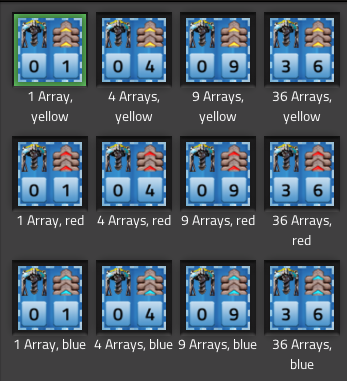

# :hammer_and_pick: Electric mining drill arrays

Space saving setup of electric mining drills in various array-sizes and all belt speeds.  

## Blueprint-Book
All blueprints are collected in a blueprint book:  
[Blueprint book](https://raw.githubusercontent.com/RundesBalli/factorio-blueprints/master/electric-mining-drill-arrays/blueprint-book.txt)

## Various Belts
Yellow, red or blue:  

  
  

## Various array-sizes
1, 4, 9 or 36 arrays:  

  

36 arrays:  

  
