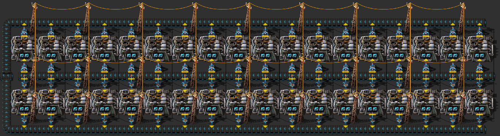

# :fire: Furnaces

Various furnace setups.

## Blueprint-Book
All blueprints are collected in a blueprint book:  
[Blueprint book](https://raw.githubusercontent.com/RundesBalli/factorio-blueprints/master/furnaces/blueprint-book.txt)

## Steel furnaces & electric furnaces
Available setups with 24, 48 or 72 furnaces. Every setup is calculated with the maximum throughput from the input belt.  

  

Same side or opposite output:  
  
  

## Steel plate production
Also available with 24, 48 or 72 furnaces.  

## With speed modules

