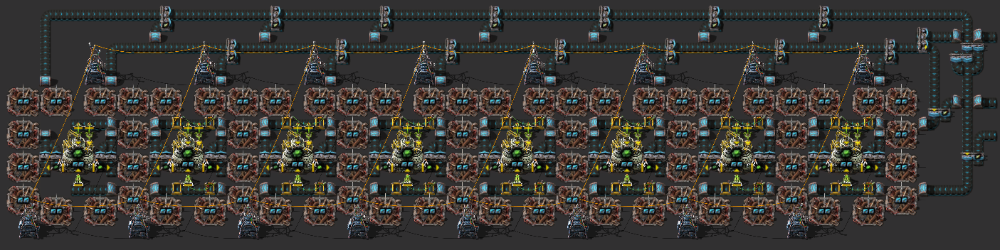
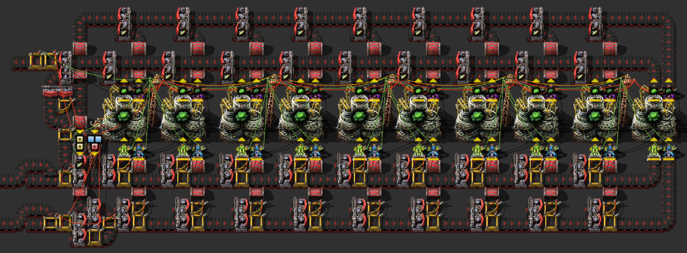

# :green_circle: Automatic Kovarex Enrichment Process

Automatic Kovarex Enrichment Process with automatic feeding of additional machines when the first machines are running at the limit.

## Blueprints

### Blue belts, with speed modules and beacons, less circuit
[Blueprint](https://raw.githubusercontent.com/RundesBalli/factorio-blueprints/master/kovarex-enrichment-process/blueprint%2Cblue.txt)

### Red belts, much circuit
[Blueprint](https://raw.githubusercontent.com/RundesBalli/factorio-blueprints/master/kovarex-enrichment-process/blueprint%2Cred.txt)

