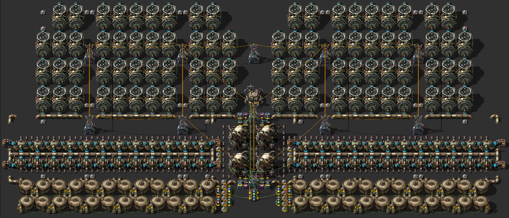

# :radioactive: 480 MW Nuclear Power Plant

[Blueprint](https://raw.githubusercontent.com/RundesBalli/factorio-blueprints/master/nuclear-power/blueprint.txt)

## Note
On the first run, you must insert one (!) single uranium fuel cell per reactor, to start the plant.

### Dependencies
You will need the [Inland Pumps](https://mods.factorio.com/mod/inland_pumps) mod.
