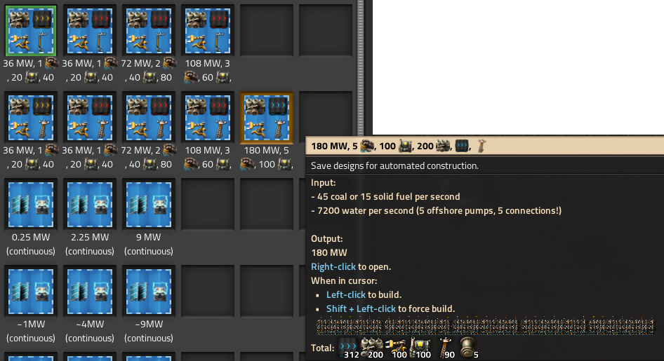

# :zap: Power sources

Some early- and lategame power sources.

## Blueprint-Book
All blueprints are collected in a blueprint book:  
[Blueprint book](https://raw.githubusercontent.com/RundesBalli/factorio-blueprints/master/power-sources/blueprint-book.txt)

### Some simple boiler/steam engine setups
Available setups for the early game with small electric poles and yellow belt, up to late game medium electric poles with blue belt.  

### Solar power with accumulators
Some solar/accumulator setups are also available. All setups in this category are suitable for continuous operation and can be operated during the and night.

 

### Variations

