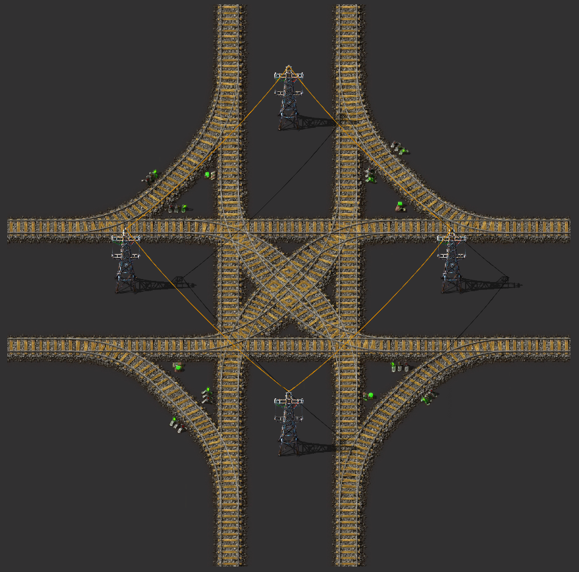
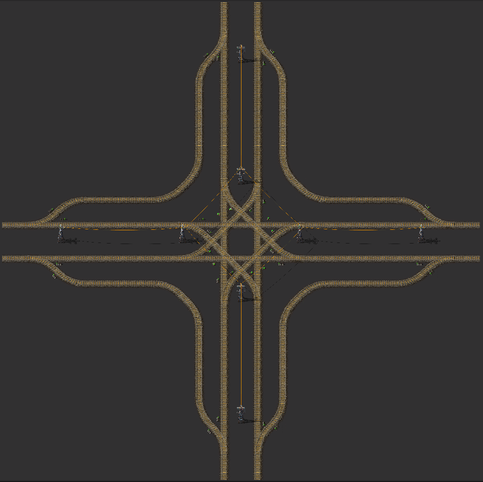
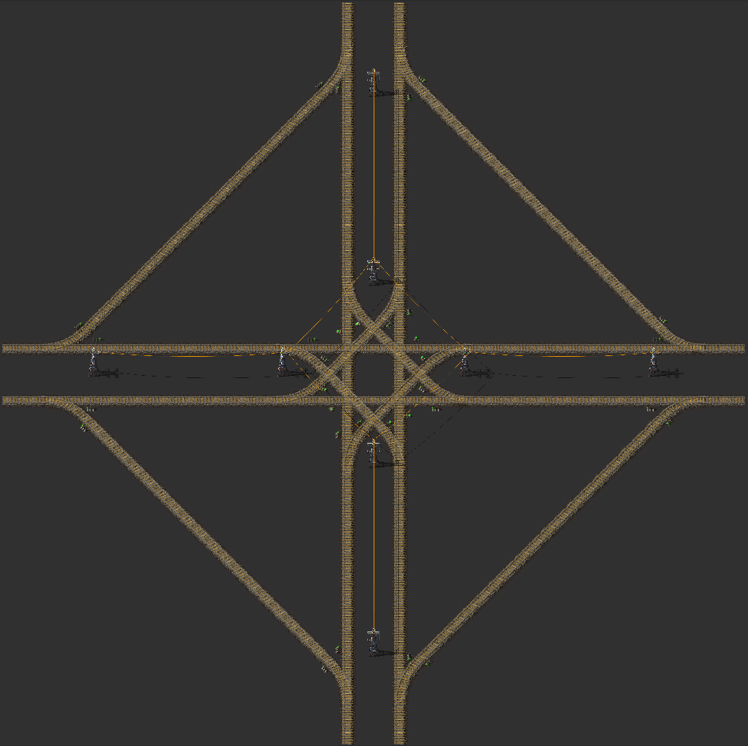
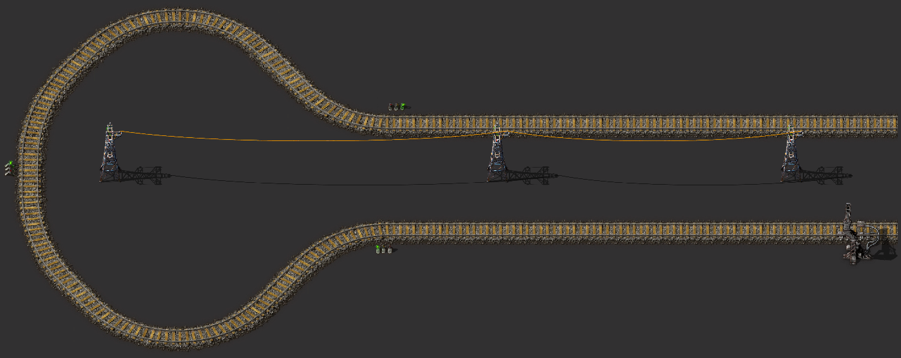
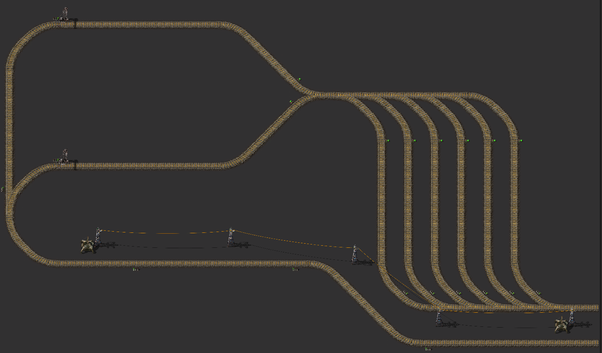
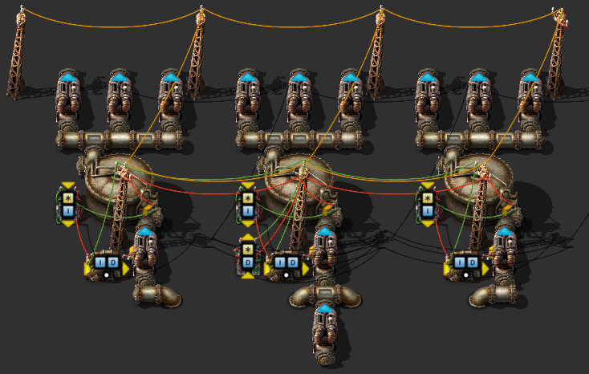
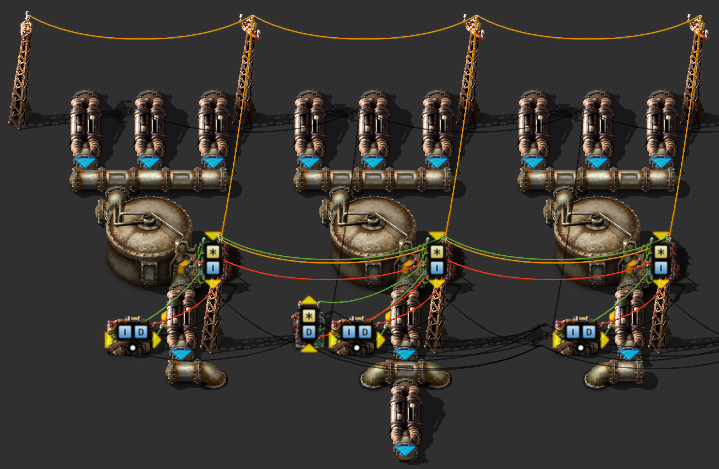

# :railway_track: Rail system

Right-hand rail system for five part trains.  
(e.g. 2x locomotive, 3x cargo-wagon)

## Blueprint-Book
All blueprints are collected in a blueprint book:  
[Blueprint book](blueprint-book.txt?raw=true)

## Various rail sections
:heavy_exclamation_mark: <b>Please refer to the notes at the end.</b>  

Straight:  
  

Curve, 90 Degrees:  
  

T-Intersection:  
  

Intersection, small:  
  

Intersection, large, space saving:  
  

Intersection, large, space wasting:  
  

Turnaround:  
  

Six waiting tracks and additionally two more after, as well as another one before:  
  

Station with 1 loading area and 3 waiting tracks:  
(alternative with 1 loading area and 5 waiting tracks)  
  

Station with 2 loading areas and 6 waiting tracks:  
Make sure that both stations have the same names!  
  

Evenly (un-)loader:  
The circuit empties/fills the tanks so that liquid wagons are not (un-)loaded gradually but evenly.  
  
  

## Notes
### Traffic light before intersection
Please make sure you **remove** the traffic light before an intersection or T-intersection or use the *«Straight, before intersection»* blueprint:  
  
  

### No intersections one after the other
Don't place intersections one after the other, or you may create a train deadlock!  
  
Place a straight line between intersections!  
  

### Grid
If you don't place the blueprints on top of each other but next to each other, then you can build a grid that fits in itself.  
